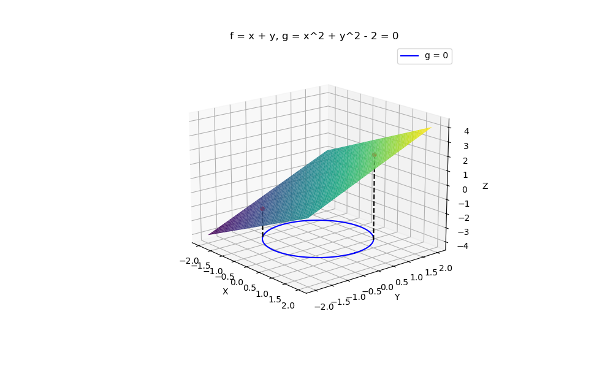
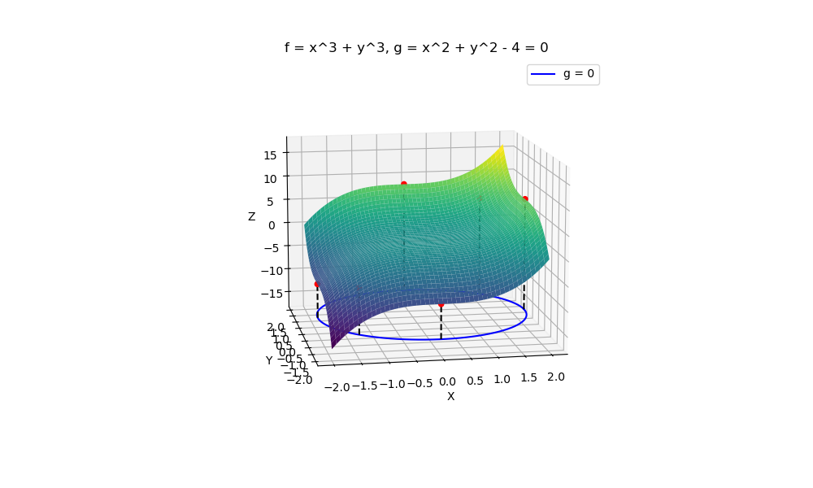

# Equality Constraint Optimization

Στην παρούσα εργασία μελετόνται οι ικανές συνθήκες δεύτερης τάξης για προβλήματα  
με μία και δύο ισοτικές δεσμεύσεις. Αρχικά, εξετάζεται η περίπτωση  μίας ισοτικής  
δεσμεύσεις και στη συνέχεια η περίπτωση δύο ισοτικών δεσμεύσεων. Στην περίπτωση των  
δύο ισοτικών δεσμεύσεων εξετάζεται μόνο η περίπτωση όπου η συνάρτηση f που βελτιστοποιείται  
έχει 3 μεταβλητές εισόδου.  
  
Ακολουθούν μερικές οπτικοποιήσεις των λύσεων που προκύπτουν:

  
Προαπαιτούμενες βιβλιοθήκες Python:  
Για την εκτέλεση του κώδικα που παρουσιάζεται στην παρούσα εργασία απαιτείται  
η χρήση των παρακάτω βιβλιοθηκών:  
- numpy για αριθμητικές πράξεις – https://www.sympy.org
- sympy για συμβολικούς και αναλυτικούς υπολογισμούς – https://numpy.org
- matplotlib για την απεικόνιση γραφημάτων – https://matplotlib.org
